```{r, include = FALSE}
knitr::opts_chunk$set(
  collapse = TRUE,
  comment = "#>"
)
```

The following screenshots show how to fit an example model in the **shinybrms** app. For instructions on how to launch the **shinybrms** app, see the [starting page](../index.html).

## Data

\
Usually, you will want to upload a custom dataset, but for the purpose of demonstration, we will choose the example dataset `MASS::bacteria` here:

\
```{r echo = FALSE, results = "hide"}
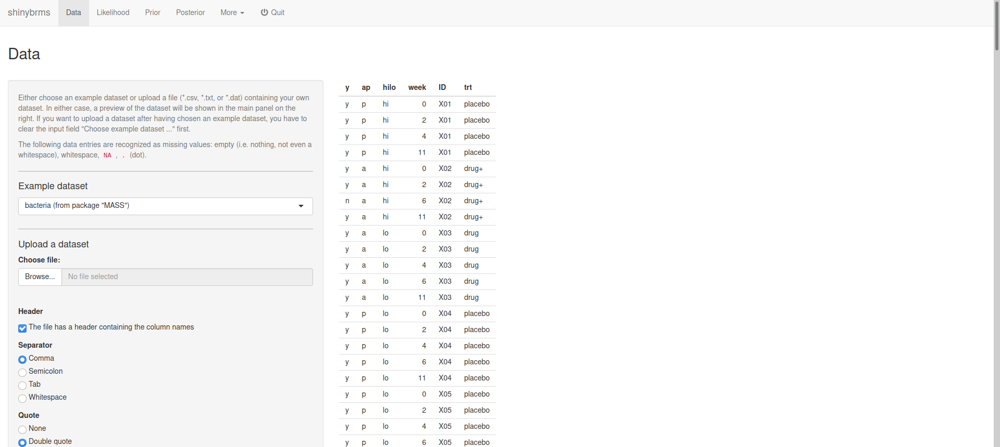
```
[](screenshots/bacteria_1.png)
*Fig. 1: Page "Data" (top).*

\
Further down the "Data" page, we may choose e.g. to show all rows of the dataset:

\
```{r echo = FALSE, results = "hide"}
knitr::include_graphics("screenshots/bacteria_2.png")
```
[](screenshots/bacteria_2.png)
*Fig. 2: Page "Data" (further down).*

## Likelihood

### Outcome

\
On page "Likelihood", the first tab is "Outcome". Here, we define the variable `y` (from our dataset `MASS::bacteria`) to be the outcome and since this is a binary outcome, we choose the distributional family "Bernoulli with logit link":

\
```{r echo = FALSE, results = "hide"}
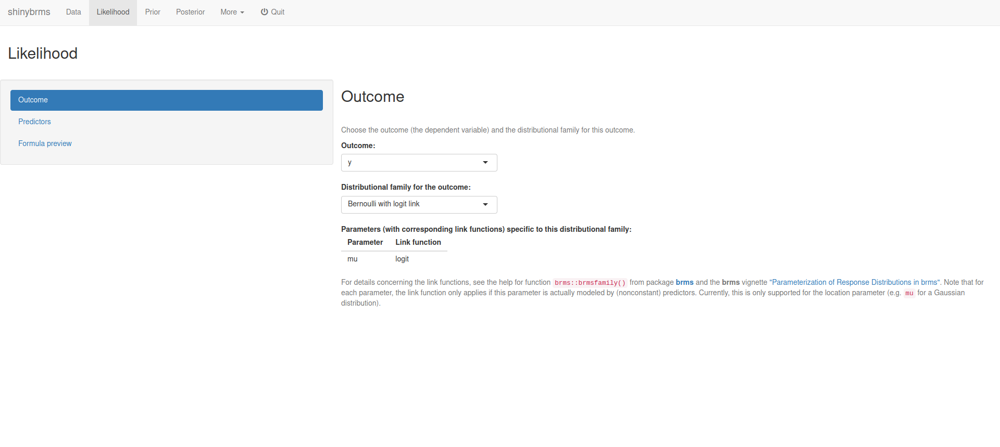
```
[](screenshots/bacteria_3.png)
*Fig. 3: Page "Likelihood", tab "Outcome".*

### Predictors

\
After selecting the tab "Predictors", we define the variables `week` and `trt` to have nonpooled main effects and variable `ID` to have partially pooled main effects:

\
```{r echo = FALSE, results = "hide"}
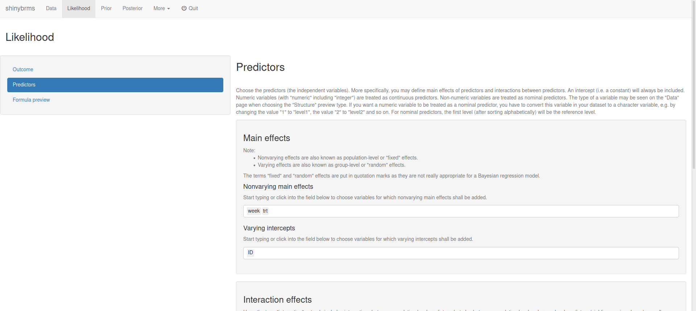
```
[](screenshots/bacteria_4.png)
*Fig. 4: Page "Likelihood", tab "Predictors" (top).*

\
After scrolling down, we set up a (nonpooled) interaction term for `week` and `trt`:

\
```{r echo = FALSE, results = "hide"}

```
[](screenshots/bacteria_5.png)
*Fig. 5: Page "Likelihood", tab "Predictors" (bottom; setting up the interaction effect).*

\
After clicking on "Add interaction term", we get:

\
```{r echo = FALSE, results = "hide"}
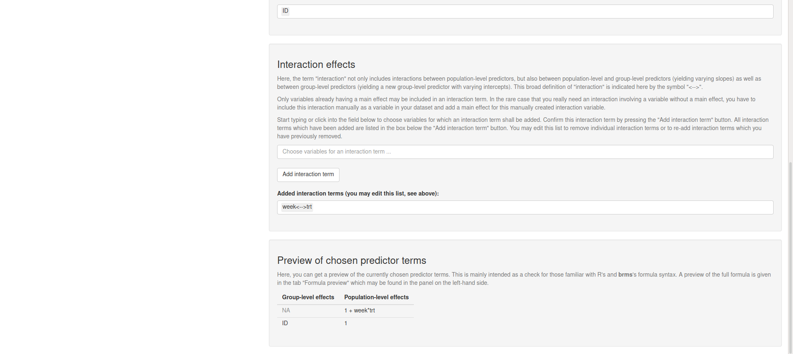
```
[](screenshots/bacteria_6.png)
*Fig. 6: Page "Likelihood", tab "Predictors" (bottom; after adding the interaction effect).*

## Prior

### Default priors

\
At the top of page "Prior", we get a table with the default priors for the model we have specified so far:

\
```{r echo = FALSE, results = "hide"}
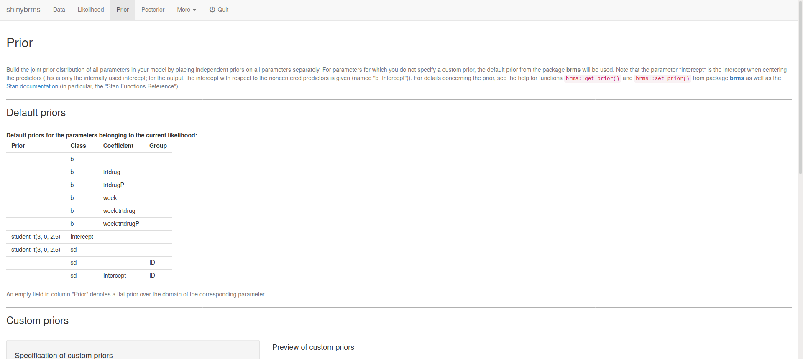
```
[](screenshots/bacteria_7.png)
*Fig. 7: Page "Prior" (top).*

\
At the bottom of page "Prior", we can specify custom priors. Here, we will use a Student-$t$ prior distribution with 3 degrees of freedom, a location parameter of 0, and a scale parameter of 10 for all regression coefficients (parameter class `b`):

\
```{r echo = FALSE, results = "hide"}
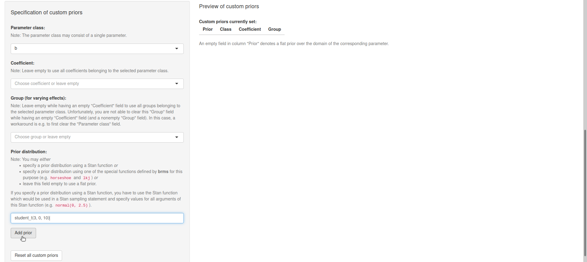
```
[](screenshots/bacteria_8.png)
*Fig. 8: Page "Prior" (bottom; setting up a custom prior).*

\
After clicking on "Add prior", we see that our Student-$t$ prior was added to the preview table on the right:

\
```{r echo = FALSE, results = "hide"}
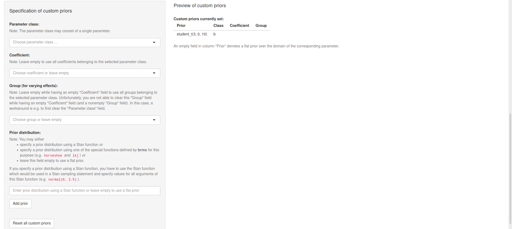
```
[](screenshots/bacteria_9.png)
*Fig. 9: Page "Prior" (bottom; after adding a custom prior).*

## Posterior

### Preparing the Stan run

\
At the top of page "Posterior", we could get a preview of the Stan code and the Stan data (and download them):

\
```{r echo = FALSE, results = "hide"}
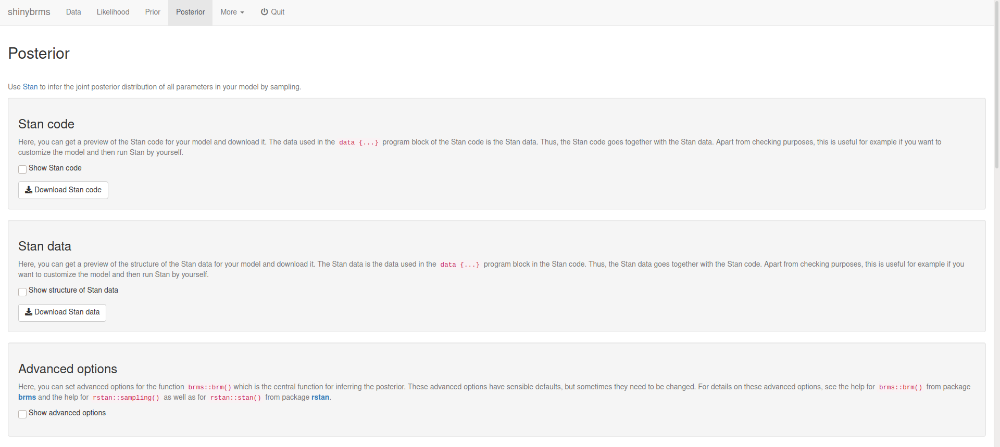
```
[](screenshots/bacteria_10.png)
*Fig. 10: Page "Posterior" (top).*

\
Here, we will scroll down to focus on the panel "Advanced options":

\
```{r echo = FALSE, results = "hide"}
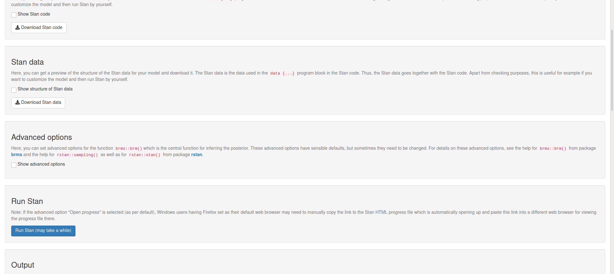
```
[](screenshots/bacteria_11.png)
*Fig. 11: Page "Posterior" (middle).*

\
There, we may set a seed for reproducibility:

\
```{r echo = FALSE, results = "hide"}
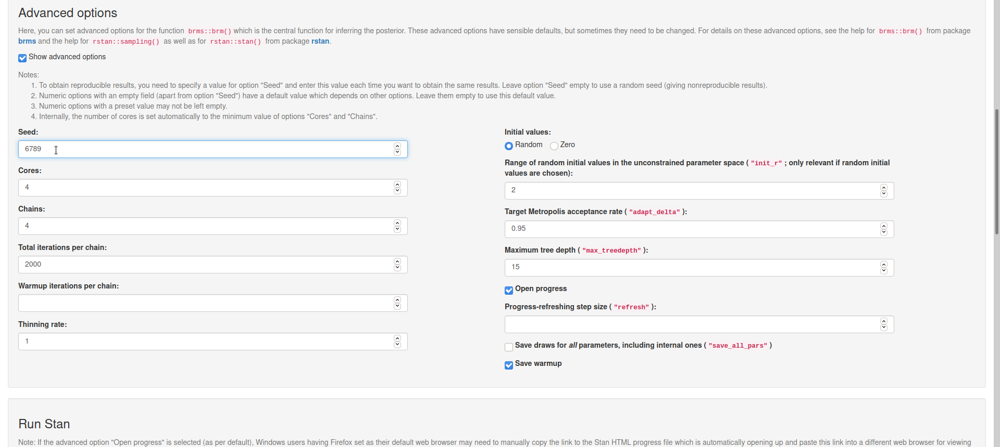
```
[](screenshots/bacteria_12.png)
*Fig. 12: Page "Posterior", panel "Advanced options".*

### Running Stan

\
Now, we head over to the fundamental part of our analysis, the inference of the posterior distribution of all parameters. Since we have everything prepared now, this is accomplished quite easily: Right below the panel "Advanced options", we find the panel "Run Stan", where we simply click the button for running Stan:

\
```{r echo = FALSE, results = "hide"}
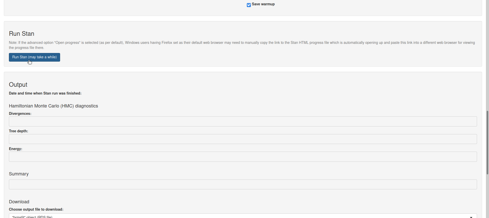
```
[](screenshots/bacteria_13.png)
*Fig. 13: Page "Posterior", panel "Run Stan".*

\
Now, Stan starts compiling the C++ code for our model and after having finished the compilation, Stan automatically starts sampling. As we have not changed the default for the advanced option "Open progress", a file will automatically open up (in a new browser tab) and show the sampling progress (after compilation has finished):

\
```{r echo = FALSE, results = "hide"}
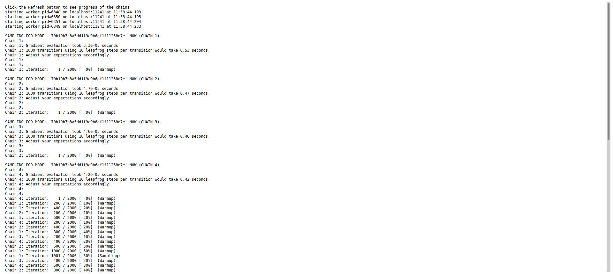
```
[](screenshots/bacteria_14.png)
*Fig. 14: Sampling progress (top).*

\
Depending on your model and data, the sampling might take a while. For the example here, the sampling is quite fast. Note that the progress file needs to be refreshed manually (by refreshing the corresponding browser tab). When Stan has finished sampling, the bottom of the progress file looks like this:

\
```{r echo = FALSE, results = "hide"}
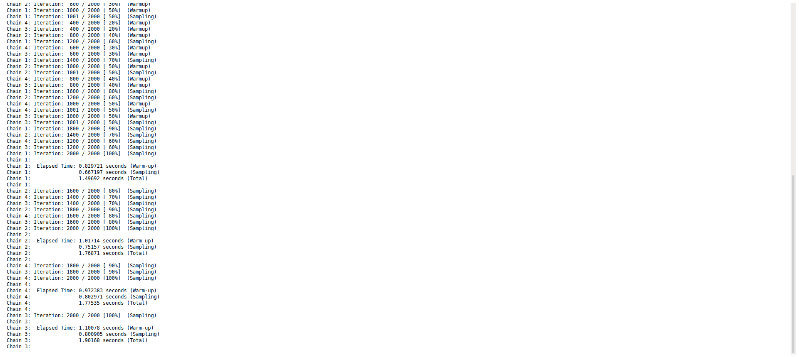
```
[](screenshots/bacteria_15.png)
*Fig. 15: Sampling progress (bottom; after end of sampling).*

### Inspecting the output

\
We can now switch back to the browser tab where **shinybrms** is running and inspect the final panel "Output" on page "Posterior". First, we can check some diagnostics specific to Hamiltonian Monte Carlo (HMC): the number of iterations ending with a divergence, the number of iterations hitting the maximum tree depth, and the Bayesian fraction of missing information for the energy transitions (E-BFMI). Here, no warnings have occurred and the HMC-specific diagnostics are all OK:

\
```{r echo = FALSE, results = "hide"}
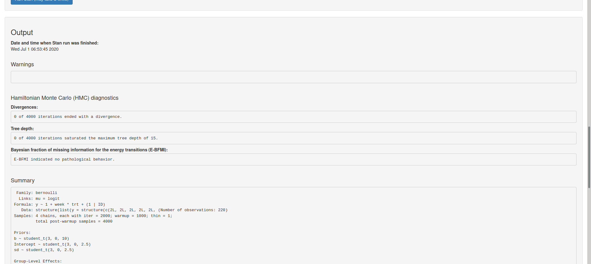
```
[](screenshots/bacteria_16.png)
*Fig. 16: Page "Posterior", panel "Output" (top).*

\
Underneath the HMC diagnostics, we get a short summary of our posterior inference including some general Markov chain Monte Carlo (MCMC) diagnostics (`Rhat`, `Bulk_ESS`, `Tail_ESS`). Here, these general MCMC diagnostics are all OK (cf. [Vehtari et al. (2020)](https://doi.org/10.1214/20-BA1221) to see why):

\
```{r echo = FALSE, results = "hide"}
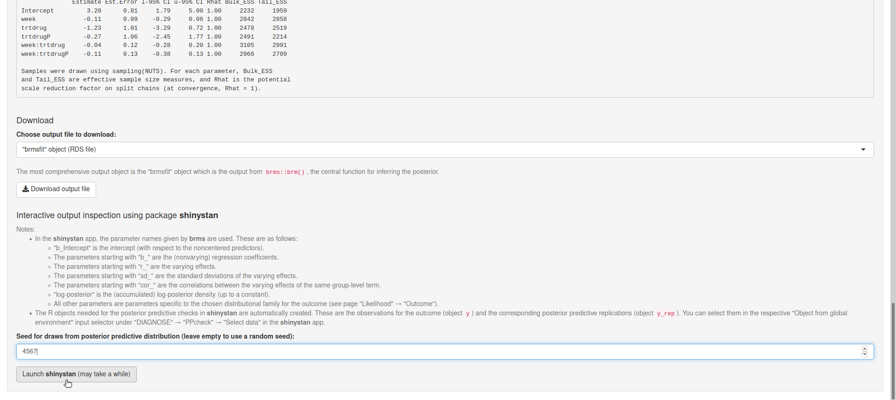
```
[](screenshots/bacteria_17.png)
*Fig. 17: Page "Posterior", panel "Output" (middle).*

\
For those who would now want to start interpreting the posterior results given under "Summary" (e.g. the posterior median and the posterior 2.5% and 97.5% quantiles), it should be noted that the output shown under "Summary" is only intended for a quick inspection. A much more comprehensive analysis of the output is possible using the Shiny app from [**shinystan**](https://CRAN.R-project.org/package=shinystan) which also offers posterior predictive checks as well as more details concerning the HMC-specific and the general MCMC diagnostics. Here, we launch the **shinystan** app by clicking the corresponding button at the bottom of the page (after having entered a seed for reproducibility of the posterior predictive checks):

\
```{r echo = FALSE, results = "hide"}
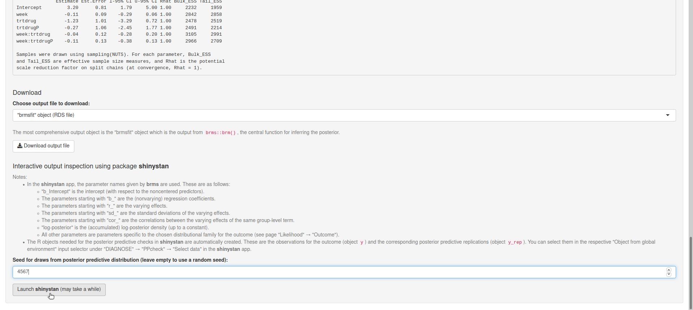
```
[](screenshots/bacteria_18.png)
*Fig. 18: Page "Posterior", panel "Output" (bottom).*

\
At this point, the **shinybrms** workflow ends and passes over to the **shinystan** workflow. Note that within the **shinybrms** app, you can also download different output objects (see Fig. 18) to analyze them outside of **shinybrms**.

# References

Vehtari A, Gelman A, Simpson D, Carpenter B, and Bürkner P-C (2020). Rank-normalization, folding, and localization: An improved $\widehat{R}$ for assessing convergence of MCMC. *Bayesian Analysis*. DOI: [10.1214/20-BA1221](https://doi.org/10.1214/20-BA1221)
