```{r, include = FALSE}
knitr::opts_chunk$set(
  collapse = TRUE,
  comment = "#>"
)
```

The following screenshots show how to fit an example model in the **shinybrms** app. For instructions how to launch the **shinybrms** app, see the [starting page](../index.html).

[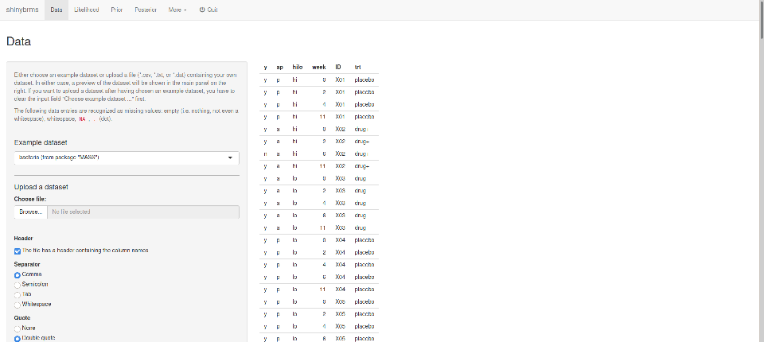](screenshots/bacteria_1.png)
```{r echo = FALSE, results = "hide"}
knitr::include_graphics("screenshots/bacteria_1.png")
```

[](screenshots/bacteria_2.png)
```{r echo = FALSE, results = "hide"}
knitr::include_graphics("screenshots/bacteria_2.png")
```

[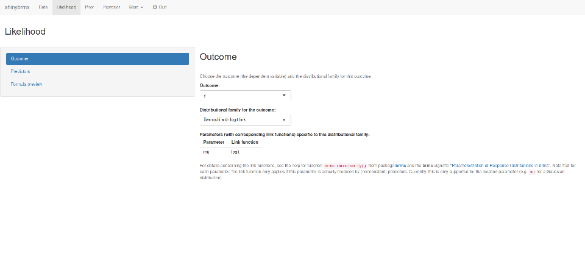](screenshots/bacteria_3.png)
```{r echo = FALSE, results = "hide"}
knitr::include_graphics("screenshots/bacteria_3.png")
```

[](screenshots/bacteria_4.png)
```{r echo = FALSE, results = "hide"}
knitr::include_graphics("screenshots/bacteria_4.png")
```

[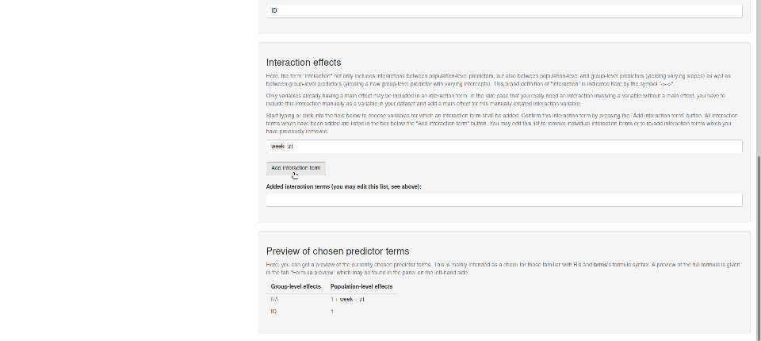](screenshots/bacteria_5.png)
```{r echo = FALSE, results = "hide"}
knitr::include_graphics("screenshots/bacteria_5.png")
```

[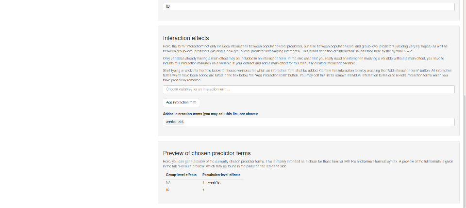](screenshots/bacteria_6.png)
```{r echo = FALSE, results = "hide"}
knitr::include_graphics("screenshots/bacteria_6.png")
```

[](screenshots/bacteria_7.png)
```{r echo = FALSE, results = "hide"}
knitr::include_graphics("screenshots/bacteria_7.png")
```

[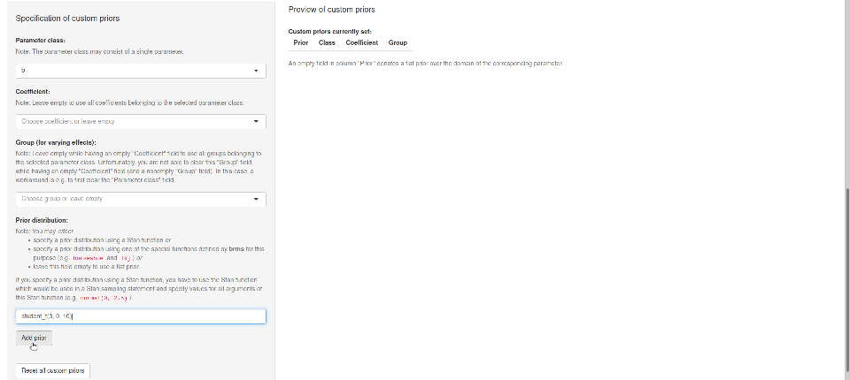](screenshots/bacteria_8.png)
```{r echo = FALSE, results = "hide"}
knitr::include_graphics("screenshots/bacteria_8.png")
```

[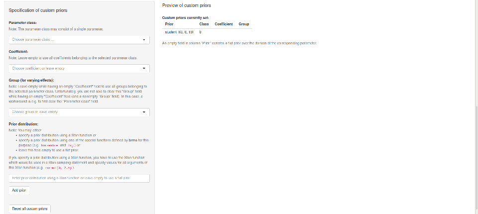](screenshots/bacteria_9.png)
```{r echo = FALSE, results = "hide"}
knitr::include_graphics("screenshots/bacteria_9.png")
```

[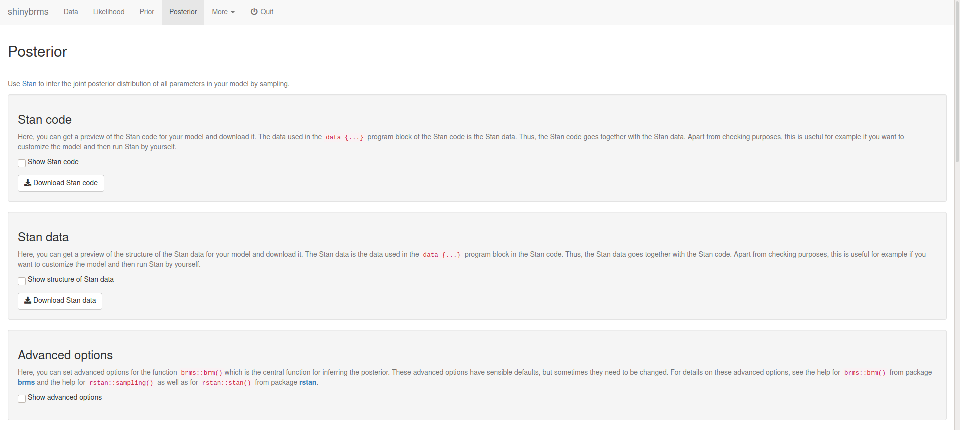](screenshots/bacteria_10.png)
```{r echo = FALSE, results = "hide"}
knitr::include_graphics("screenshots/bacteria_10.png")
```

[](screenshots/bacteria_11.png)
```{r echo = FALSE, results = "hide"}
knitr::include_graphics("screenshots/bacteria_11.png")
```

[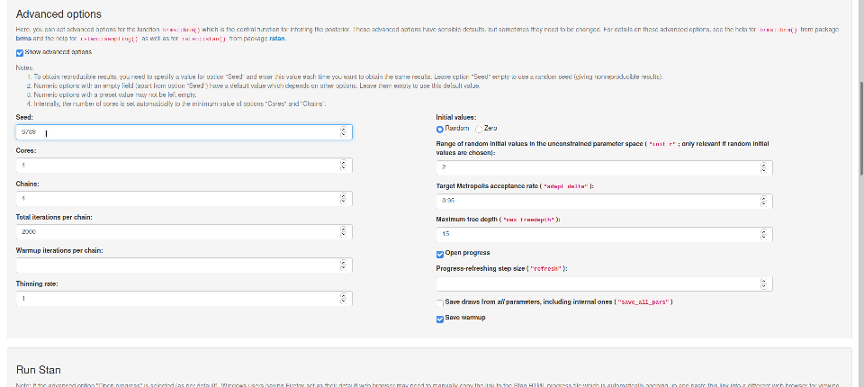](screenshots/bacteria_12.png)
```{r echo = FALSE, results = "hide"}
knitr::include_graphics("screenshots/bacteria_12.png")
```

[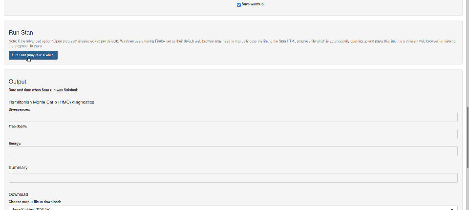](screenshots/bacteria_13.png)
```{r echo = FALSE, results = "hide"}
knitr::include_graphics("screenshots/bacteria_13.png")
```

[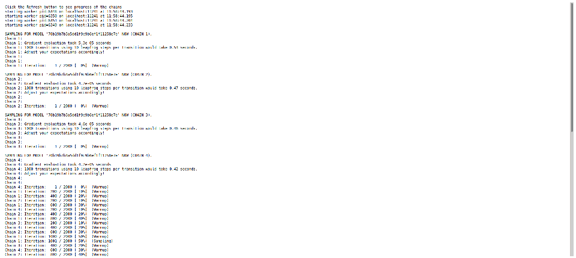](screenshots/bacteria_14.png)
```{r echo = FALSE, results = "hide"}
knitr::include_graphics("screenshots/bacteria_14.png")
```

[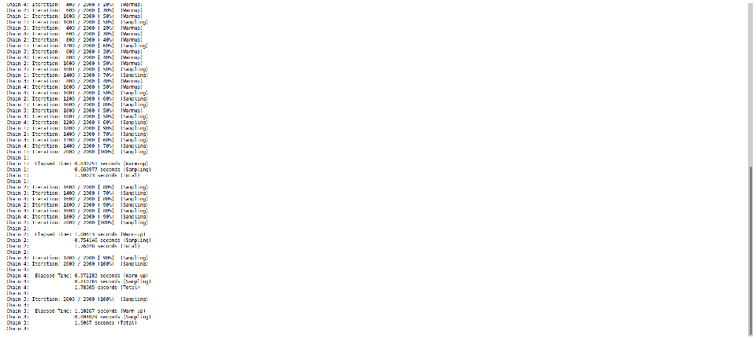](screenshots/bacteria_15.png)
```{r echo = FALSE, results = "hide"}
knitr::include_graphics("screenshots/bacteria_15.png")
```

[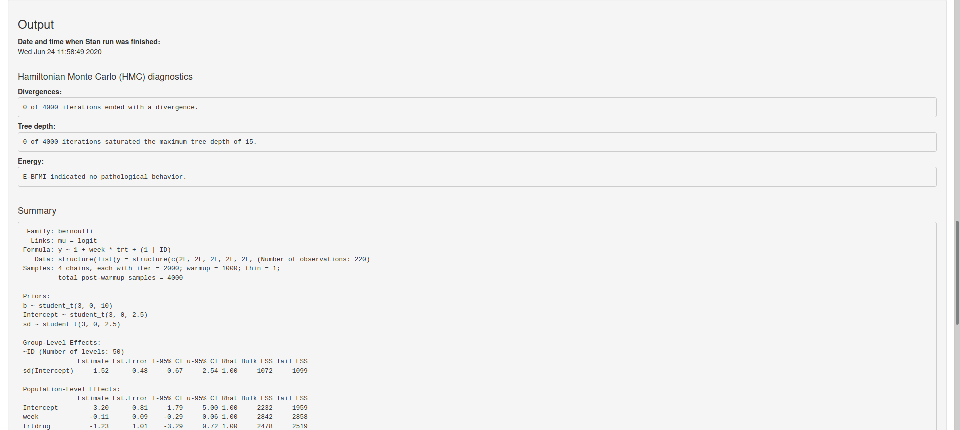](screenshots/bacteria_16.png)
```{r echo = FALSE, results = "hide"}
knitr::include_graphics("screenshots/bacteria_16.png")
```

[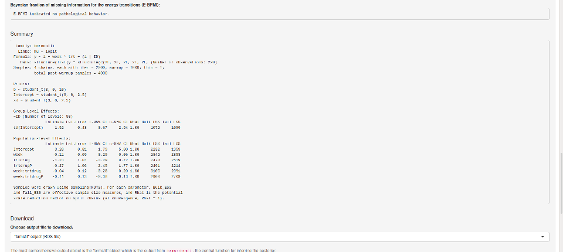](screenshots/bacteria_17.png)
```{r echo = FALSE, results = "hide"}
knitr::include_graphics("screenshots/bacteria_17.png")
```
