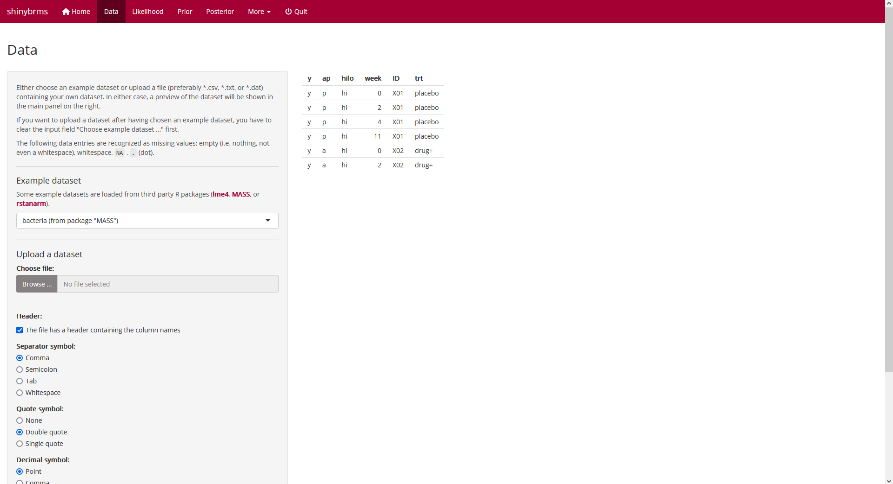
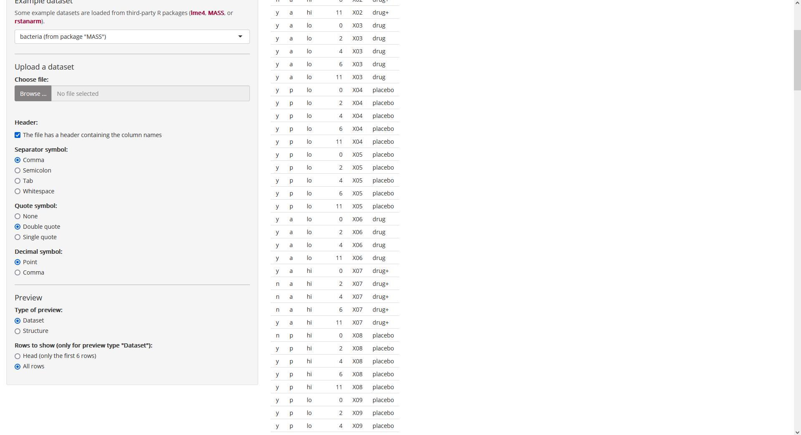
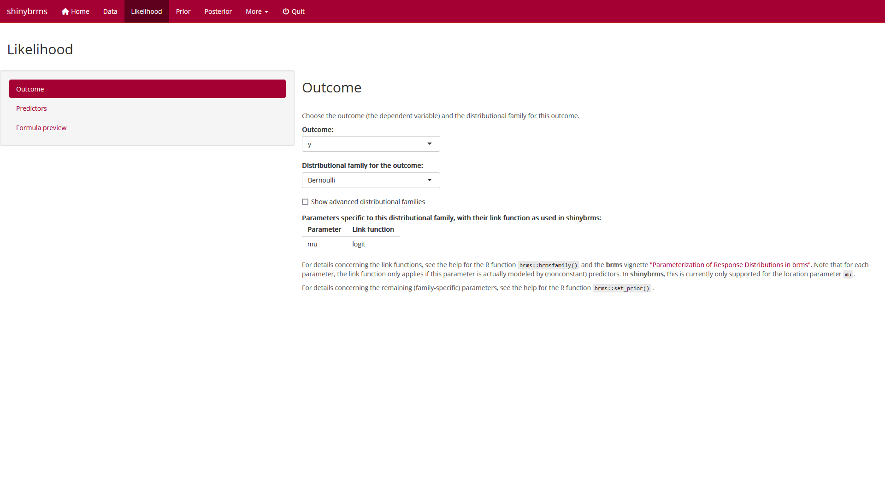
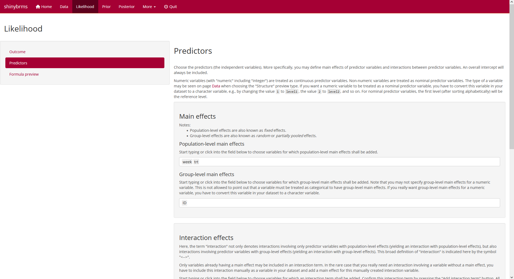
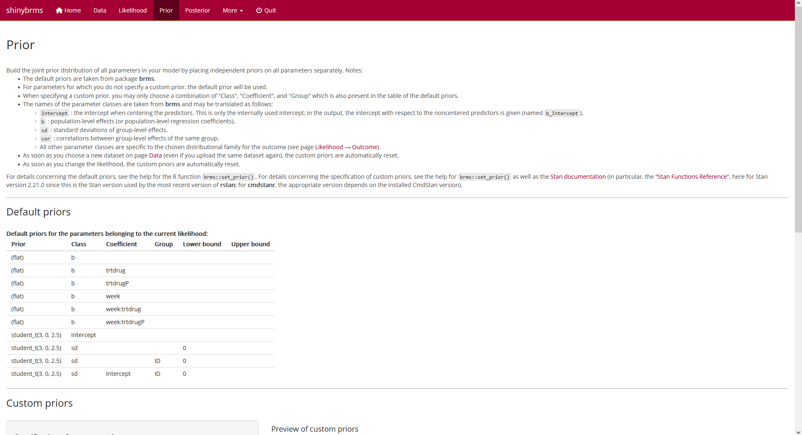
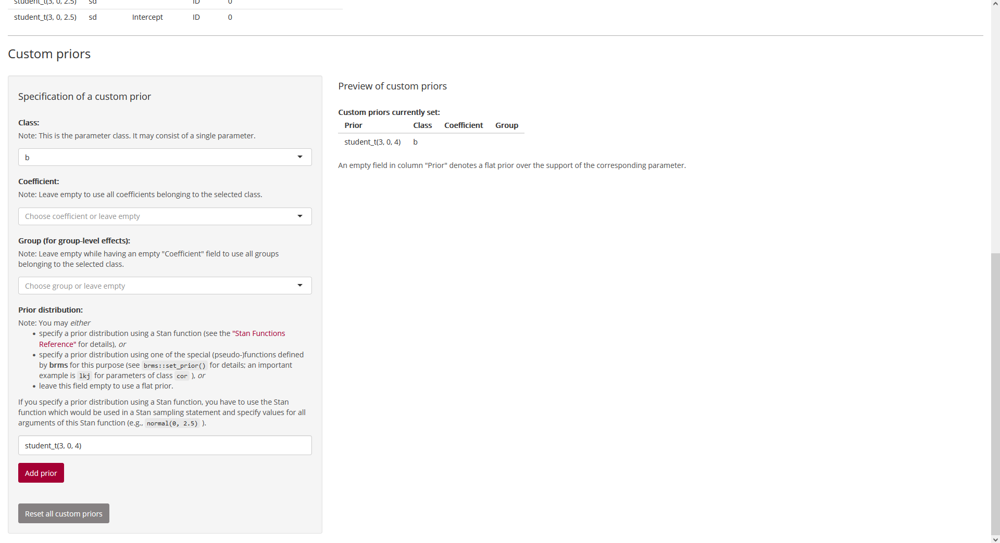
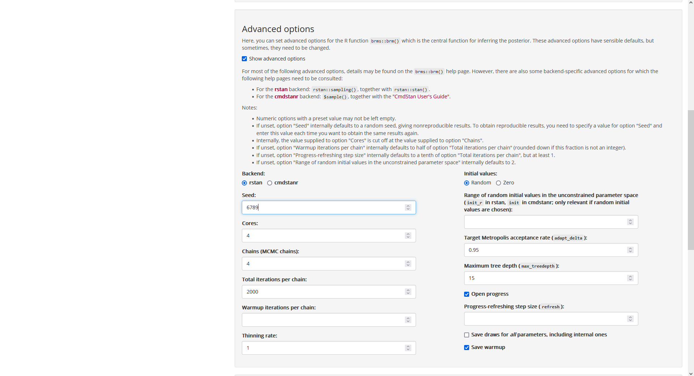
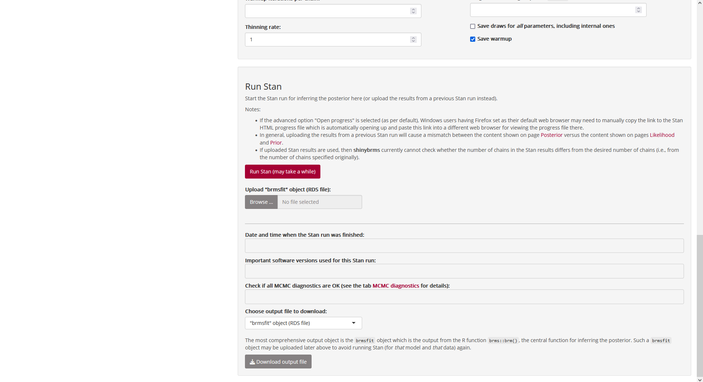
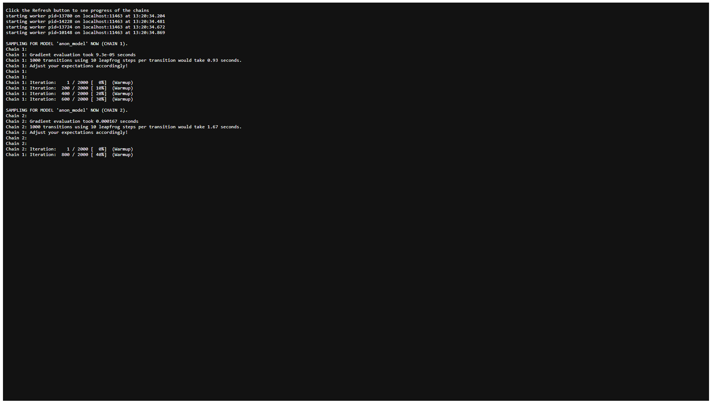
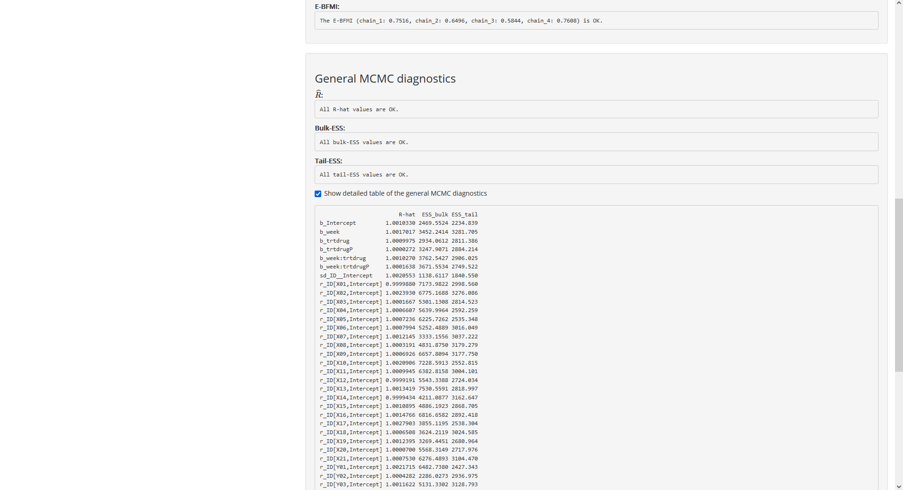

```{r, include = FALSE}
knitr::opts_chunk$set(
  collapse = TRUE,
  comment = "#>"
)
```

The following screenshots show how to fit an example model in the **shinybrms** app. For instructions on how to launch the **shinybrms** app, see the [starting page](../index.html).

## Home

\
After launching the **shinybrms** app, the following page is shown:

\
```{r echo = FALSE, results = "hide"}
knitr::include_graphics("screenshots/Home.png")
```
[](screenshots/Home.png)
*Fig. 1: Page "Home".*

## Data

\
Usually, you will want to upload a custom dataset, but for the purpose of demonstration, we will choose the example dataset `MASS::bacteria` here:

\
```{r echo = FALSE, results = "hide"}

```
[](screenshots/Data.png)
*Fig. 2: Page "Data" (top).*

\
Further down the "Data" page, we may choose e.g. to show all rows of the dataset:

\
```{r echo = FALSE, results = "hide"}

```
[](screenshots/Data_AllRows.png)
*Fig. 3: Page "Data" (further down when showing all rows of the dataset).*

## Likelihood

### Outcome

\
On page "Likelihood", the first tab is "Outcome". Here, we define the variable `y` (from our dataset `MASS::bacteria`) to be the outcome and since this is a binary outcome, we choose the distributional family "Bernoulli with logit link":

\
```{r echo = FALSE, results = "hide"}

```
[](screenshots/Likelihood_Outcome.png)
*Fig. 4: Page "Likelihood", tab "Outcome".*

### Predictors

\
After selecting the tab "Predictors", we define the variables `week` and `trt` to have nonpooled main effects and variable `ID` to have partially pooled main effects:

\
```{r echo = FALSE, results = "hide"}

```
[](screenshots/Likelihood_Predictors.png)
*Fig. 5: Page "Likelihood", tab "Predictors" (top).*

\
After scrolling down, we set up a (nonpooled) interaction term for `week` and `trt`:

\
```{r echo = FALSE, results = "hide"}
knitr::include_graphics("screenshots/Likelihood_Predictors_Int.png")
```
[](screenshots/Likelihood_Predictors_Int.png)
*Fig. 6: Page "Likelihood", tab "Predictors" (bottom; setting up the interaction effect).*

\
After clicking on "Add interaction term", we get:

\
```{r echo = FALSE, results = "hide"}

```
[](screenshots/Likelihood_Predictors_done.png)
*Fig. 7: Page "Likelihood", tab "Predictors" (bottom; after adding the interaction effect).*

## Prior

### Default priors

\
At the top of page "Prior", we get a table with the default priors for the model we have specified so far:

\
```{r echo = FALSE, results = "hide"}

```
[](screenshots/Prior_Default.png)
*Fig. 8: Page "Prior" (top).*

\
At the bottom of page "Prior", we can specify custom priors. Here, we will use a Student-$t$ prior distribution with 3 degrees of freedom, a location parameter of 0, and a scale parameter of 10 for all regression coefficients (parameter class `b`):

\
```{r echo = FALSE, results = "hide"}
knitr::include_graphics("screenshots/Prior_Custom.png")
```
[](screenshots/Prior_Custom.png)
*Fig. 9: Page "Prior" (bottom; setting up a custom prior).*

\
After clicking on "Add prior", we see that our Student-$t$ prior was added to the preview table on the right:

\
```{r echo = FALSE, results = "hide"}

```
[](screenshots/Prior_Custom_done.png)
*Fig. 10: Page "Prior" (bottom; after adding a custom prior).*

## Posterior

### Run Stan

\
On page "Posterior", the first tab is "Run Stan". At the top of this tab, we could get a preview of the Stan code and the Stan data (and download them):

\
```{r echo = FALSE, results = "hide"}
knitr::include_graphics("screenshots/Posterior_Run.png")
```
[](screenshots/Posterior_Run.png)
*Fig. 11: Page "Posterior", tab "Run Stan" (top).*

\
Here, we focus on the panel "Advanced options" where we may set a seed for reproducibility:

\
```{r echo = FALSE, results = "hide"}

```
[](screenshots/Posterior_Run_AdvOpts.png)
*Fig. 12: Page "Posterior", tab "Run Stan", panel "Advanced options".*

\
Now we head over to the fundamental part of our analysis, the inference of the posterior distribution of all parameters. Since we have everything prepared now, this is accomplished quite easily: Right below the panel "Advanced options", we find the panel "Run Stan" where we simply click the button for running Stan:

\
```{r echo = FALSE, results = "hide"}

```
[](screenshots/Posterior_Run_Run.png)
*Fig. 13: Page "Posterior", tab "Run Stan", panel "Run Stan".*

\
Now Stan starts compiling the C++ code for our model and after having finished the compilation, Stan automatically starts sampling. As we have not changed the default for the advanced option "Open progress", a file will automatically open up (in a new browser tab) after completion of the compilation. This file shows the sampling progress:

\
```{r echo = FALSE, results = "hide"}

```
[](screenshots/Posterior_Sampling_1.png)
*Fig. 14: Sampling progress (top).*

\
Depending on your model and data, the sampling might take a while. For the example here, the sampling proceeds quite fast. Note that the progress file needs to be refreshed manually (by refreshing the corresponding browser tab). When Stan has finished sampling, the bottom of the progress file looks like this:

\
```{r echo = FALSE, results = "hide"}
knitr::include_graphics("screenshots/Posterior_Sampling_2.png")
```
[](screenshots/Posterior_Sampling_2.png)
*Fig. 15: Sampling progress (bottom; after completion of sampling).*

\
We can now switch back to the browser tab where **shinybrms** is running. In the panel "Run Stan", we now see the date and time when the Stan run was completed.
Furthermore, we get the result of an "overall check" for the Markov chain Monte Carlo (MCMC) diagnostics which will be given in detail in the tab "MCMC diagnostics". The result of this overall check is shown in a box underneath the date and time box as well as in the pop-up notification telling us that the Stan run was completed. Here, all MCMC diagnostics are OK:

\
```{r echo = FALSE, results = "hide"}
knitr::include_graphics("screenshots/Posterior_Run_Run_done.png")
```
[](screenshots/Posterior_Run_Run_done.png)
*Fig. 16: Page "Posterior", tab "Run Stan", panel "Run Stan" (after completion of the Stan run).*

### MCMC diagnostics (details)

\
The tab "MCMC diagnostics" first shows a description which MCMC diagnostics are checked here:

\
```{r echo = FALSE, results = "hide"}
knitr::include_graphics("screenshots/Posterior_Diagnostics.png")
```
[](screenshots/Posterior_Diagnostics.png)
*Fig. 17: Page "Posterior", tab "MCMC diagnostics" (top).*

\
Underneath this description, the diagnostic results for the given Stan run are shown; first the diagnostics specific to Hamiltonian Monte Carlo (HMC) and then the general MCMC diagnostics:

\
```{r echo = FALSE, results = "hide"}
knitr::include_graphics("screenshots/Posterior_Diagnostics_General.png")
```
[](screenshots/Posterior_Diagnostics_General.png)
*Fig. 18: Page "Posterior", tab "MCMC diagnostics" (bottom).*

\
For the general MCMC diagnostics (which are computed for each parameter as well as for the accumulated log-posterior density), it is also possible to show a detailed table:

\
```{r echo = FALSE, results = "hide"}

```
[](screenshots/Posterior_Diagnostics_General_Detailed.png)
*Fig. 19: Page "Posterior", tab "MCMC diagnostics", detailed table of the general MCMC diagnostics.*

### Summary

\
Since all MCMC diagnostics look good, we may start interpreting the posterior. In the tab "Summary", we get a short summary of our Stan run, including the mean (column `Estimate`), the standard deviation (column `Est.Error`), and the 2.5% and 97.5% quantiles (columns `l-95% CI` and `u-95% CI`, respectively) of the marginal posterior distribution of the most important parameters:

\
```{r echo = FALSE, results = "hide"}
knitr::include_graphics("screenshots/Posterior_Summary.png")
```
[](screenshots/Posterior_Summary.png)
*Fig. 20: Page "Posterior", tab "Summary".*

\
The tab "Download" offers the possibility to download different output objects which may be analyzed outside of **shinybrms**:

\
```{r echo = FALSE, results = "hide"}
knitr::include_graphics("screenshots/Posterior_Download.png")
```
[](screenshots/Posterior_Download.png)
*Fig. 21: Page "Posterior", tab "Download".*

\
Note that the output shown in tab "Summary" is only intended for a quick inspection. A much more comprehensive analysis of the output is possible using the [Shiny](https://shiny.rstudio.com/) app from [**shinystan**](https://CRAN.R-project.org/package=shinystan) which also offers posterior predictive checks as well as more details concerning the HMC-specific and the general MCMC diagnostics. Here, we launch the **shinystan** app by clicking the corresponding button in the tab "Launch **shinystan**" (after having entered a seed for the reproducibility of the posterior predictive checks):

\
```{r echo = FALSE, results = "hide"}
knitr::include_graphics("screenshots/Posterior_shinystan.png")
```
[](screenshots/Posterior_shinystan.png)
*Fig. 22: Page "Posterior", tab "Launch **shinystan**".*

\
At this point, the **shinybrms** workflow ends and passes over to **shinystan**.
